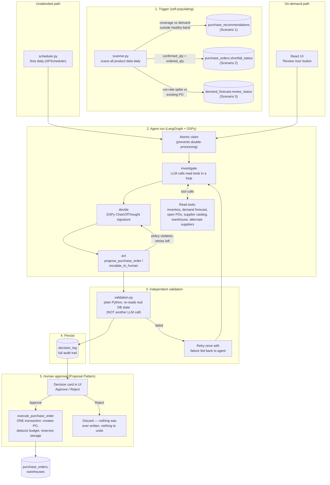

# AI Purchasing Agent

An AI agent that assists a buyer at a retail/quick-commerce company in making purchasing
decisions. The agent investigates a purchasing situation using a fixed set of read/write
tools, reasons about the relevant constraints, decides on an action, and either proposes
it (pending human approval) or executes it once approved. It runs both on-demand (a
manual "Review now" button) and unattended, on a daily cron schedule that scans all
product data for situations that need attention.

Three of the assignment's four scenarios are implemented end-to-end:

- **Scenario 1 — Purchase Recommendation Review**
- **Scenario 2 — Supplier Cannot Fulfil the Purchase**
- **Scenario 3 — Demand/Forecast Has Changed**

Scenario 4 (Purchasing Constraint) is not built as its own standalone trigger, but its
core mechanic — an agent that wants to buy more but a hard constraint blocks it, and has
to find a compliant alternative instead of blindly executing — is already the backbone of
every decision in this system (see [Guardrails](#guardrails-not-left-to-the-llm) below).

## Contents

- [Architecture](#architecture)
- [Design philosophy](#design-philosophy)
- [Mock data](#mock-data)
- [Setup and run instructions](#setup-and-run-instructions)
- [The three scenarios](#the-three-scenarios)
- [How decisions are validated](#how-decisions-are-validated)
- [Evaluation approach](#evaluation-approach)
- [What's not built](#whats-not-built)

## Architecture



**The key architectural decision**: LangGraph owns *control flow* (looping over tools,
retrying a refused action, routing between steps); DSPy owns *reasoning* (a single
structured signature — situation + evidence in, decision + action out) that's a plain,
swappable module independent of the orchestration around it. Three scenarios reuse this
exact same engine — only the trigger table, the situation prompt, and the allowed
decision vocabulary differ per scenario (see `backend/app/services/scenario{1,2,3}.py`).

### Guardrails not left to the LLM

Hard constraints (MOQ, budget, storage) are enforced in plain Python
(`backend/app/tools/policy.py`), not by asking the LLM to remember and apply them
correctly on every call. `propose_purchase_order` re-reads the current DB state itself,
runs these checks, and refuses outright with no override if any fail — the LLM decides
*what* to try, the tool decides whether it's *allowed*. This is also the mechanism
underlying Scenario 4 ("Purchasing Constraint") even though there's no dedicated trigger
for it: any time an agent's chosen action would exceed budget/storage/MOQ, it's refused
and the agent must find a compliant alternative or escalate — see e.g. Scenario 1's
SKU-004 case or Scenario 3's budget-constrained eval case.

### The Proposal Pattern

The agent never writes to `purchase_orders` directly. `propose_purchase_order` only
validates and returns a plain dict describing what it would do — nothing is committed.
A human approving that proposal is the only thing that ever triggers
`execute_purchase_order`, which creates the PO and updates the warehouse's budget/storage
in one transaction. Rejecting a proposal needs no rollback logic, because nothing was
ever written in the first place.

## Design philosophy

- **The LLM is the reasoning engine, not the data-access layer.** It never writes SQL or
  invents queries — it only picks from a fixed set of parameterized Python tool functions
  (`backend/app/tools/read_tools.py`, `write_tools.py`) and supplies arguments. This
  removes SQL-injection risk, hallucinated schema, and hallucinated arithmetic as failure
  modes; what the LLM actually contributes is *which* tools to call, in what order, and
  what to conclude from the results — see the tool-call trace in any decision card in the
  UI for a concrete example.
- **Deterministic guardrails, deterministic validation.** Anything that must always be
  true (MOQ, budget, storage, "does projected coverage make sense") is checked in plain
  Python, independent of the LLM, both before a proposal is accepted and after a decision
  is made.
- **A human is always the one who spends money.** No purchase order is ever created
  without an explicit approval click, regardless of the agent's confidence.
- **One shared engine, not four bespoke agents.** Scenario-specific code is limited to a
  situation prompt, an allowed-decision list, and a validator — the tool-calling loop,
  the decision structure, the approval flow, and the execution transaction are identical
  across all three scenarios.
- **Self-populating triggers.** The system doesn't wait for someone to hand it a
  pre-flagged situation — `scanner.py` looks at real inventory/demand/PO data daily and
  decides for itself whether a Scenario 1, 2, or 3 situation currently exists. A healthy
  product is never touched or shown anywhere.

## Mock data

SQLite (`backend/purchasing_agent.db`, auto-created), seeded by `backend/app/seed.py`
with 14 products across 14 warehouses, each number chosen deliberately:

| Products | Why |
|---|---|
| SKU-001..007 | Scenario 1 cases: oversupply→reject, MOQ rounding→modify, exact match→accept, budget/storage blocked→investigate, demand spike→modify, low stock→accept, ample stock→reject |
| SKU-008 | Scenario 2: supplier confirms 250 of 500; a faster alternate supplier exists |
| SKU-009, SKU-010 | Discovered by the scanner with **zero pre-seeding** (no recommendation/shortfall flag set in advance), to prove detection is real |
| SKU-011, SKU-012, SKU-013 | Healthy control group — coverage comfortably inside the safe band, must **never** be flagged |
| SKU-014 | Scenario 3: forecast planned 10/day, actual pace is 25/day (2.5x) against an existing, now-insufficient PO |

Full rationale for every number lives as comments directly in `seed.py`.

## Setup and run instructions

Requires Python 3.12+, Node 18+, and (optionally) a [Google AI Studio](https://aistudio.google.com/apikey)
API key for Gemini — the system runs fully offline against a deterministic stub agent
without one.

```bash
# 1. Backend
cd backend
python3 -m venv ../.venv && source ../.venv/bin/activate   # or reuse an existing venv
pip install -r ../requirements.txt
cp ../.env.example ../.env    # edit ../.env: add GOOGLE_API_KEY, or leave USE_STUB_LLM=true

uvicorn app.main:app --reload --port 8000
# auto-seeds the SQLite DB on first run; the cron fires once immediately, then daily
```

```bash
# 2. Frontend (separate terminal)
cd frontend
npm install
echo "VITE_API_BASE=http://localhost:8000" > .env
npm run dev
# open http://localhost:5173
```

```bash
# 3. Evaluation (offline, no API key needed)
cd backend
USE_STUB_LLM=true python ../eval/scenario1_eval.py
USE_STUB_LLM=true python ../eval/scenario2_eval.py
USE_STUB_LLM=true python ../eval/scenario3_eval.py
```

Useful env vars (see `.env.example` for the full list):

- `USE_STUB_LLM=true` — run against a deterministic rule-based stand-in instead of Gemini
  (same tool-calling shape, simpler decisions) — no API key needed.
- `SCENARIO1_CRON_INTERVAL_SECONDS` — how often the unattended scan+review cycle runs.
  Default is `86400` (once/day); it also always fires once immediately on startup. Set to
  `0` to disable it entirely.

## The three scenarios

Each scenario is triggered from its own queue, reviewed by the same agent engine, and
produces a `DecisionLog` row. All three appear in one unified "pending item" picker in
the UI, tagged afterward with which scenario it turned out to be.

| Scenario | Trigger table | Allowed decisions | Service |
|---|---|---|---|
| 1. Recommendation Review | `purchase_recommendations.status` | accept / modify / reject / investigate | `services/scenario1.py` |
| 2. Supplier Shortfall | `purchase_orders.shortfall_status` | accept_shortfall / additional_po / escalate | `services/scenario2.py` |
| 3. Demand/Forecast Changed | `demand_forecast.review_status` | plan_sufficient / increase_order / escalate | `services/scenario3.py` |

Manual trigger: `POST /api/scenario{1,2,3}/...` (see `backend/app/api/routes.py`).
Unattended: `backend/app/scheduler.py` sweeps all three every cycle.

## How decisions are validated

Two independent safety layers sit between "the agent decided something" and "money gets
spent," neither of which is another LLM call:

**Layer 1 — before a human ever sees it** (`backend/app/agent/validation.py` +
`backend/app/api/orchestrator.py`): after the agent decides, a plain-Python check
re-reads the real database state and verifies projected coverage (on-hand + confirmed
incoming + any proposed qty) lands in a sane range relative to demand, and that
budget/storage weren't blown. If it fails, the orchestrator retries the *entire* agent
run once, feeding the specific failure back into the prompt. If it still fails, the
situation is forced to require human approval rather than silently accepted or retried
indefinitely.

**Layer 2 — before anything is written** (the Proposal Pattern): any proposed purchase
order unconditionally requires human approval, regardless of confidence. `POST
/api/approvals/decide` is the *only* code path that ever calls `execute_purchase_order`.

Why a second, independent, non-LLM check matters: if the same model that made the
decision also checked its own work, a systematic reasoning error would likely pass its
own check. `validation.py` never touches the LLM — it's the same kind of check a
real inventory system's own business rules would run regardless of who or what proposed
the change.

## Evaluation approach

`eval/scenario{1,2,3}_eval.py` — three small, plain Python scripts (not a framework),
10 scripted cases total, run directly against the same orchestrator the API uses. Each
case checks, independently:

- **Was the decision correct?** — `log.decision in expected_decisions`
- **Did the agent obtain the necessary information?** — inspects the actual tool-call
  trace to confirm inventory/demand/open-POs (and alternate-suppliers, where relevant)
  were genuinely looked up
- **Did it respect relevant constraints?** — confirms no proposal carries a
  `policy_violations` flag
- **Did it take the appropriate action?** — confirms an action was proposed exactly when
  (and only when) it should have been
- **Did it validate the result?** — confirms the independent validator actually ran
- **What happens when the initial action doesn't work?** — every eval file includes at
  least one deliberately adversarial case (no viable alternate supplier, budget too tight
  to fix anything, a hard constraint with no compliant option) that must fail validation
  correctly *and* force human approval, proving the retry-then-escalate path isn't just
  theoretical

Cases are constructed either by reusing the seeded data as-is, or by inserting throwaway
product/warehouse/supplier fixtures inline (`_make_fixture()`) to isolate edge cases the
default seed data doesn't cover — e.g. a shortfall that turns out not to matter, or a
demand spike the existing plan already absorbs.

Run with `USE_STUB_LLM=true` for fast, deterministic, offline runs, or without it to
exercise the real Gemini agent (slower, uses API quota, more nuanced decisions).

## What's not built

- **Scenario 4 (Purchasing Constraint)** as its own standalone trigger — its underlying
  mechanism (hard guardrails forcing a compliant alternative) already runs inside every
  decision in Scenarios 1–3; see [Guardrails](#guardrails-not-left-to-the-llm).
- A hosted/deployed demo — the system runs locally only (see
  [Setup and run instructions](#setup-and-run-instructions)).
- The cron interval is a fixed timer, not a real "market hours" or event-driven trigger.
